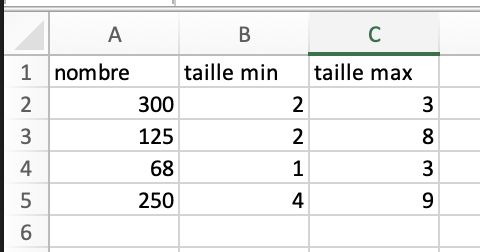
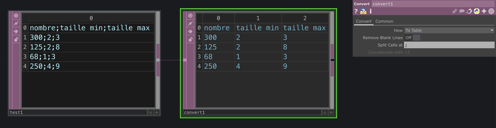
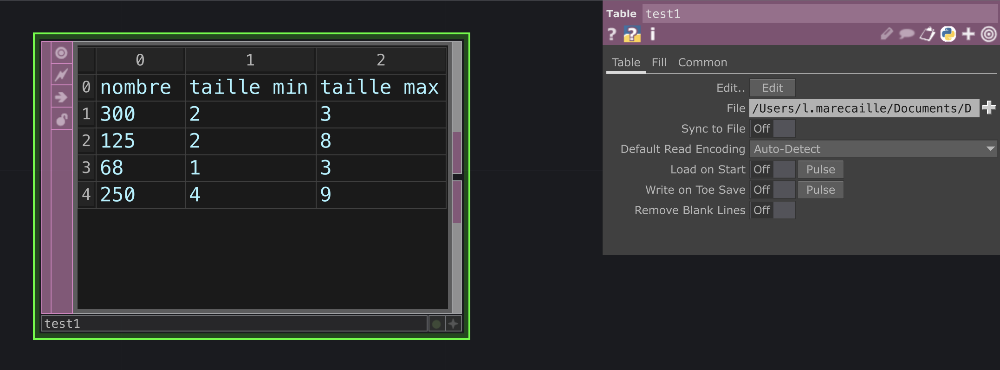
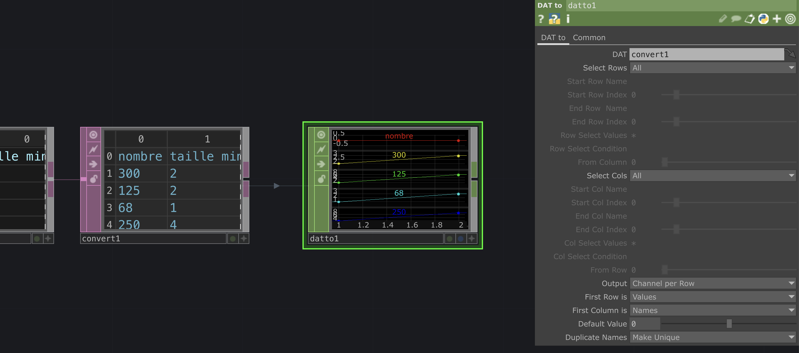
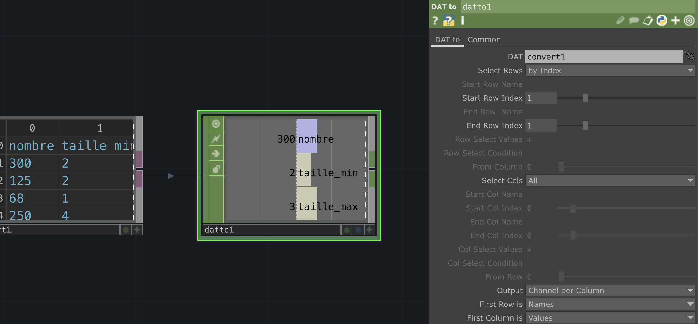
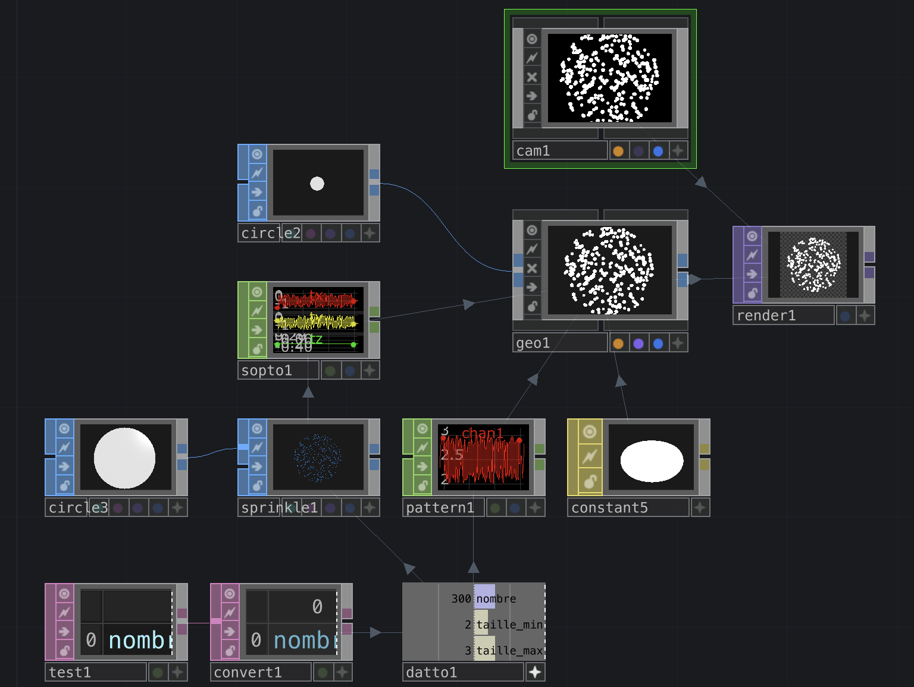
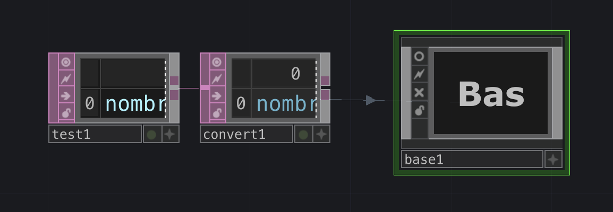
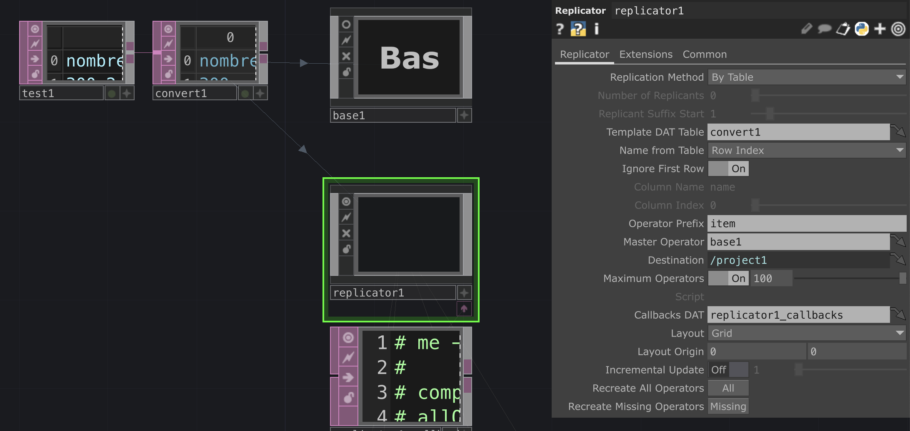
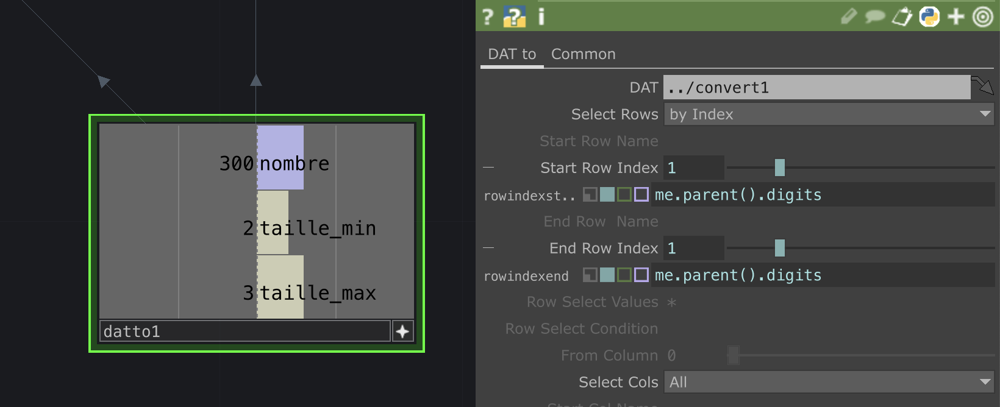
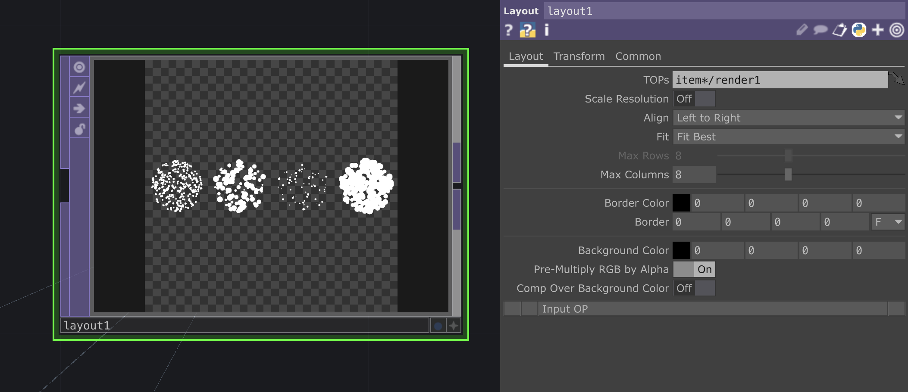

# Dataviz_TD_FR

## Importer un tableau de données

J'ai crée un tableau .csv :

Dans Touchdesigner, je crée un `Table` DAT et je vais chercher mon fichier avec le paramètre "File".

Le fichier présente autant de lignes que dans mon tableau, mais les colonnes ne sont pas mises en formes, elles sont juste séparées par des `;`.

Pour recréer les colonnes, je crée un `Convert` DAT et dans le paramètre "Split Cells at", j'écris ";".

Si j'exporte mon tableau en .txt (séparé par tabulation), je peux aussi l'ouvrir dans TD avec un `Table` DAT en allant chercher mon fichier avec le paramètre "File", et le tableau sera directement mis en forme.

## Sélectionner des cases

Pour sélectionner un ou plusieurs cases de mon tableau et pouvoir utiliser les valeurs, je crée un `DAT To` CHOP.

Par défaut, il sélectionne tout le tableau, il me fait un channel par ligne, il ne considère que la première ligne est des valeurs et que la première colonne est les noms.

Ici, je voudrais avoir un channel par colonnes, en sachant que la première ligne ce sont les noms et la première colonne ce sont des valeurs.

De plus, je voudrais ne sélectionner que la première ligne de valeur.

Je modifie les paramètres "Select Rows" pour choisir "By Index" et je ne garde que l'index 1 (car l'index 0 c'est les noms).
Ensuite je change : 
- Output "Channel per Column"
- First Row is "Name"
- First Column is "Values"

## Créer un nuage de points

Pour créer un nuage de points avec mon nombre de points, ainsi que la taille mininum et la taille maximum, je commence par créer un `Circle` SOP. Je rajoute un `Sprinkle` SOP, et je définis le nombre de points comme étant le nombre de mon `DAT To` CHOP.

Je crée ensuite un `SOP to` CHOP, afin d'avoir la position x, y et z de chacun des points.

Pour appliquer ces positions à mes points, je crée un second `Circle` SOP, que je relie à un `Geo` COMP.

J'active l'instanciation dans mon Geo, et je donne le `SOP to` comme "Translate OP" dans les paramètres.

Pour la taille des cercles, je crée un `Pattern` CHOP et je sélectionne "Random" comme Type, je définis la Length comme étant mon nombre de points, et dans les deux paramètres "To Range", je mets la taille min et max.

De nouveau dans le Geo, je mets le Pattern comme Scale OP dans les paramètres d'instanciation.

Je règle la taille du `Circle2` pour que mes points soient plus ou moins grands et se passent plus ou moins par dessus.

## Créer un Replicator de nuages de points

Je veux qu'il y ai autant de nuages de points que de lignes de mon tableau.

J'ajoute un `Constant` MAT que j'applique à mon Geo, puis un `Camera` COMP à mon network, ainsi qu'un `Render` TOP, auquel je donne une résolution de 800 par 800 pixels.

J'ajuste la position z de la Camera pour que mon nuage de points remplisse un peu plus mon Render.

Je veux mettre tout mon network dans une Base, sauf le `test1` et le `convert1`, donc je les décale et je sélectionne le reste, puis je fais clic-droit > Collapse Selected.

Je peux rentrer dans la Base en double-cliquant dessus ou en appuyant sur I, mais d'abord je vais créer le `Replicator` COMP.

Dans les paramètres du Replicator, je mets mon tableau `convert1` dans le paramètre "Template DAT Table", et `Base1` comme "Master Operator" pour qu'il le reproduise pour chaque ligne de mon tableau.

Normalement, 4 (comme mes 4 lignes) Bases se créent : item 1 à 4. Si je rentre dans les bases, chaque nuage de points est le même. Pour que chaque base crée le nuage de points de sa ligne, il faut que je modifie la base exemple.

Je rentre donc dans `Base1`, et dans le `datto1`, je modifie les paramètres pour qu'au lieu de choisir la ligne 1, il choissise la ligne du numéro de la base (ici 1, mais différents pour item 2 à 4). Dans le paramètre Start Row Index et End Row Index, j'écris donc "me.parent().digits"

Ensuite je sors de la Base, et sur le `Replicator` je clique sur le bouton "Recreate All Operators".

Maintenant si je rentre dans les bases `item` 1 à 4, chaque nuage de points est différents.

Finalement, pour les voir tous ensemble, je crée un `Layout` TOP, et dans le paramètre TOPs j'écris "item*/render1", afin de sélectionner le TOP render1 dans chaque base item.

# Dataviz_TD_FR
# Dataviz_TD_FR
